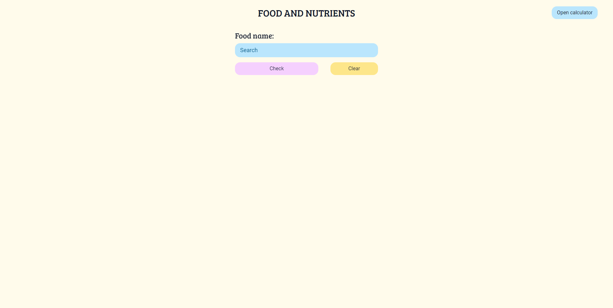
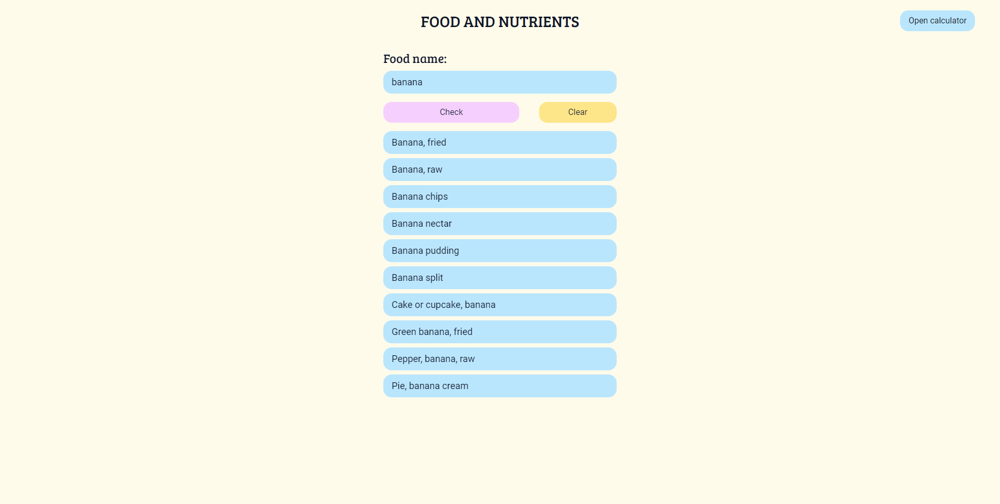
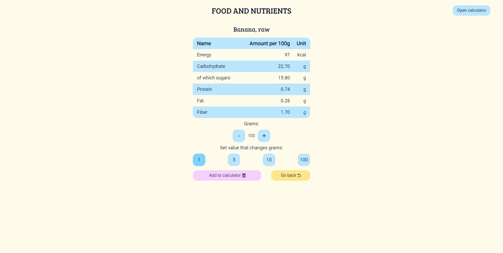

# Food and Nutrients

> A web app using FoodData Central API to display nutritional values of any food you can think of and provides verified information about it. It is a simple, easy-to-use app that shows information about five fundamental nutrients, such as energy, carbohydrate (of which sugars), protein, fat, and fiber.

## Table of Contents

-   [Demo](#demo)
-   [Site](#Site)
-   [Technologies Used](#technologies-used)
-   [Features](#features)
-   [Setup](#setup)
-   [Usage](#usage)
-   [Project Status](#project-status)
-   [Room for Improvement](#room-for-improvement)
-   [Acknowledgements](#acknowledgements)
-   [Contact](#contact)

## Demo

> Working live demo is [_here_](https://www.foodandnutrients.info/).

## Site

### Landing page



### Filled input with results



### Details



## Technologies Used

-   ReactJS - version 18.2.0
-   TypeScript - version 4.8.4
-   TailwindCSS - version 3.1.8
-   Redux Toolkit - version 1.8.6

## Features

-   Get helpful information about your favorite food in a few seconds
-   Receive ten foods that best match your query
-   Every query is cached, locally

## Setup

To run this project, install it locally using npm:

```
$ git clone https://github.com/fczajka/fan-reactjs.git
$ cd fan-reactjs
$ npm install
```

## Usage

Once you complete the setup, run `npm start` to start the application. You will then be able to access it at localhost:3000. After doing so, you are good to go.

## Project Status

Completed.

## Room for improvement

-   Use toastify
-   Add code splitting and SSR
-   Refactor code

## Acknowledgements

This project was inspired by http://www.ilewazy.pl/

## Contact

Created by [@fczajka](mailto:franekczajkaa@gmail.com) - feel free to contact me!
